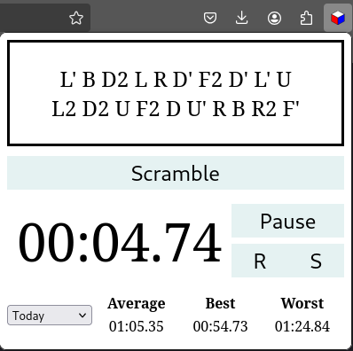

# Cube Scrambler
A browser extension to give a quick random cube scramble with an easy way to time & record your solve.

Use Ctrl + Shift + Space bar to launch the pop-up window with a new random scramble. Hit Space to start
the timer and Space again to stop it. Hit 'z' to save the time to your history or 'x' to discard. And 
finally hit 'c' to get a new scramble (this will also reset the timer). 

To delete saved times press Del to bring up the delete dialog.

